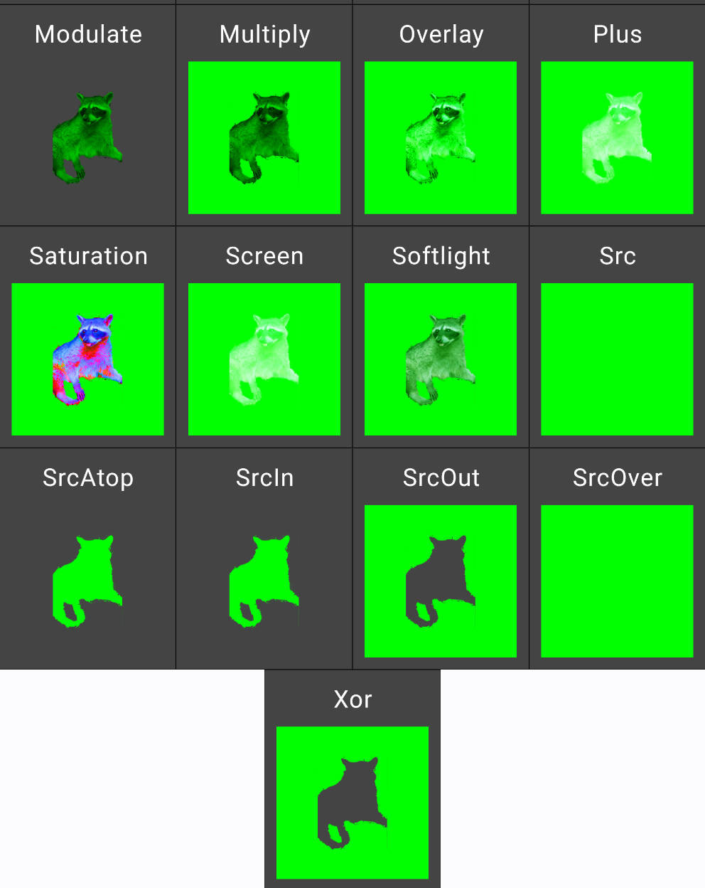

# image-blend-examples
Android Jetpack Compose: testing the effects of BlendMode with Image ColorFilter.

    Image(
      painter = painterResource(id = R.drawable.ic_coati),
      colorFilter = CororFilter.tint(blendMode = mode, color = Color.Green),
      )

Resulting display:

